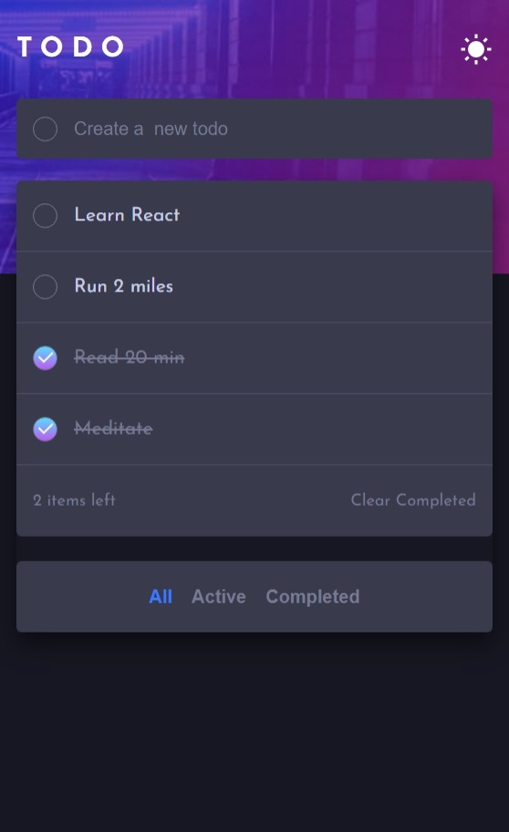
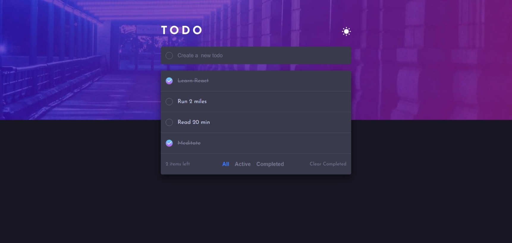

# Todo app

The classic todo app with a few twists! This app includes a dark/light theme toggle and saves the todos in local storage.

## Table of contents

- [Overview](#overview)
  - [The challenge](#the-challenge)
  - [Screenshot](#screenshot)
  - [Links](#links)
- [My process](#my-process)
  - [Built with](#built-with)
- [Author](#author)

## Overview

### The challenge

Users should be able to:

- View the optimal layout for the app depending on their device's screen size
- See hover states for all interactive elements on the page
- Add new todos to the list
- Mark todos as complete
- Delete todos from the list
- Filter by all/active/complete todos
- Clear all completed todos
- Toggle light and dark mode

### Screenshot

### Links

- Solution URL: [GitHub](https://github.com/JhonEduard26/todo-app)
- Live Site URL: [GitHub Pages](https://jhoneduard26.github.io/todo-app/)

## My process

### Built with

- Semantic HTML5 markup
- CSS custom properties
- Flexbox
- CSS Grid
- Mobile-first workflow
- [React](https://reactjs.org/) - JS library

## Author

- Website - [Jhon Eduard Bocanegra](https://github.com/JhonEduard26)
- Frontend Mentor - [@JhonEduard26](https://www.frontendmentor.io/profile/JhonEduard26)
- Twitter - [@JhonBocanegra26](https://twitter.com/JhonBocanegra26)
